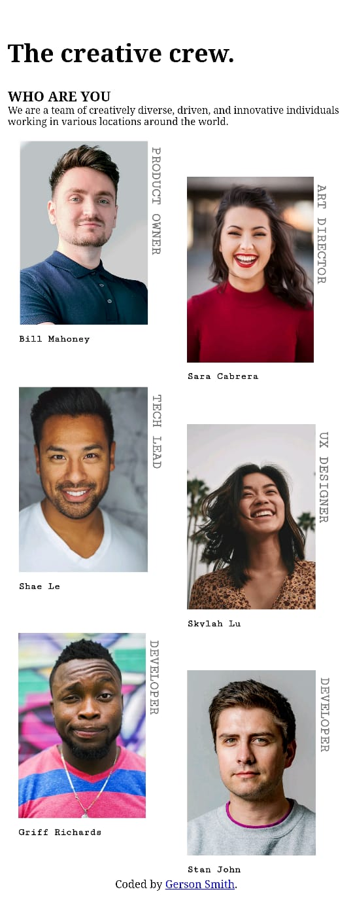

# Make It Real - NAME OF THE PROJECT

This is a solution for the 404 Not Found page implementation for the Gerson Camacho.


## Table of contents

- [Overview](#overview)
  - [The challenge](#the-challenge)
  - [Screenshot](#screenshot)
- [My process](#my-process)
  - [Built with](#built-with)
  - [What I learned](#what-i-learned)
  - [Continued development](#continued-development)
  - [Useful resources](#useful-resources)
- [Author](#author)
- [Acknowledgments](#acknowledgments)


## Overview

### The challenge

Users should be able to:

- Create the HTML structure
- Apply styling to the elements
- Implement media queries for different screen sizes
- Use flexbox for layout
- Rotate text using CSS

### Screenshot


&nbsp;

;


## My process

### Built with

- Semantic HTML5 markup
- CSS custom properties
- Flexbox
- Mobile-first workflow

### What I learned

### Major Learnings

A key takeaway from this project was learning how to use flexbox to create flexible and responsive layouts.


Here is a code snippet highlighting how I used flexbox:


```css
/* Adjustments for mobile screens */
.perfil {
  background-color: white;
  font-family: 'Courier New', Courier, monospace;
  font-weight: bold;
  width: 150px;
  height: 210px;
  text-align: center;
  margin: 2px;

  display: flex;
  flex-direction: column;
  align-items: flex-start;
  justify-content: space-between;
}

```

### Continued development

In future projects, I will continue to focus on learning how to organize HTML elements and improve responsive design. This includes honing my skills in positioning elements effectively and ensuring that layouts adapt smoothly to various screen sizes. Mastering these skills will contribute to creating more polished and user-friendly designs.

### Useful resources

  - [Flexbox Tutorial ](https://www.youtube.com/watch?v=YlwMPADJXHI&list=PLBdkl5-ytBTy0eedUcQ6t8Q8M5clbxLh-&index=2)- A useful resource for learning Flexbox.

## Author

- Website - [Gerson Smith Kevin Omar Camacho Cobeñas](https://gersonsmithkevin.github.io/My-Team-Page/)


## Acknowledgments

A special thanks to my ProInnóvate classmates for their support and to the tutors at Make It Real for their valuable guidance. Your help has been greatly appreciated.

